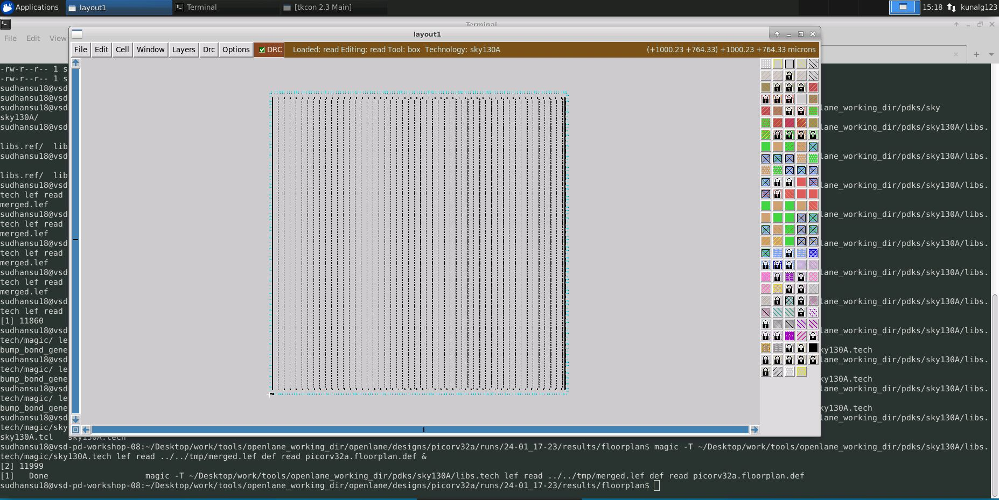
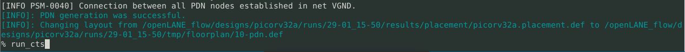

# opensource_physical_design
Learning with lab based physical design workshop organized by VSD. 

# **Table of Contents**

# OpenSource Physical Design
  This repository contains all the information studied and created during the [Advanced Physical Design Using OpenLANE / SKY130](https://www.vlsisystemdesign.com/advanced-physical-design-using-openlane-sky130/) workshop. It is primarily foucused on a complete RTL2GDS flow using the open-soucre flow named OpenLANE. [PICORV32A](https://github.com/cliffordwolf/picorv32) RISC-V core design is used for the purpose.

# Table of Contents
  - [Introduction To RTL to GDSII-Flow](#introduction-to-rtl-to-gdsii-flow)
  - [About Google SkyWater PDK](#about-google-skywater-pdk)
  - [List of All Open-Source Tools Used](#list-of-all-open-source-tools-used)
  - [Setting Up Environment](#setting-up-environment)
  - [Day 1 - Inception of open-source EDA, OpenLANE and Sky130 PDK](#day-1---inception-of-open-source-eda-openlane-and-sky130-pdk)
    - [Basic IC Design Terminologies](#basic-ic-design-terminologies)
    - [Introduction To RISC-V](#introduction-to-risc-v)
    - [SoC Design and OpenLANE](#soc-design-and-openlane)
      - [Open-Source PDK Directory Structure](#open-source-pdk-directory-structure)
      - [What is OpenLANE](#what-is-openlane)
    - [Open-Source EDA Tools](#open-source-eda-tools)
      - [OpenLANE Initialization](#openlane-initialization)
      - [Design Preparation](#design-preparation)
      - [Design Synthesis and Results](#design-synthesis-and-results)
  - [Day 2 - Good floorplan vs bad floorplan and introduction to library cells](#day-2---good-floorplan-vs-bad-floorplan-and-introduction-to-library-cells)
    - [Chip Floorplanning](#chip-floorplanning)
      - [Utilization Factor and Aspect Ratio](#utilization-factor-and-aspect-ratio)
      - [Power Planning](#power-planning)
      - [Pin Placement](#pin-placement)
      - [Floorplan using OpenLANE](#floorplan-using-openlane)
      - [Review Floorplan Layout in Magic](#review-floorplan-layout-in-magic)
    - [Placement](#placement)
      - [Placement and Optimization](#placement-and-optimization)
      - [Placement using OpenLANE](#placement-using-openlane)
    - [Cell Design and Characterization Flows](#cell-design-and-characterization-flows)
      - [Cell Design Flow](#cell-design-flow)
      - [Characterization Flow](#characterization-flow)
  -  [Day 3 - Characterization of library cells](#Need-for-Library-Characterization)
  -  [Perform Timing analysis in OpenSTA with custom cell](#Perform-Timing-analysis-in-OpenSTA-with-custom-cell)
  
  - [References](#References)
  - [Acknowledgement](#Acknowledgements-and-credits)
 
# Introduction To RTL to GDSII Flow
  RTL to GDSII Flow refers to the all the steps involved in converting a logical Register Transfer Level(RTL) Design to a fabrication ready GDSII format. GDSII is a database file format which is an industry standard for data exchange of IC layout artwork.
  The RTL to GSDII flow consists of following steps:
  - RTL Synthesis
  - Static Timing Analysis(STA)
  - Design for Testability(DFT)
  - Floorplanning
  - Placement
  - Clock Tree Synthesis(CTS)
  - Routing
  - GDSII Streaming
 
 All the steps are further discussed in details in the repository.
  
# About Google SkyWater PDK
  Google and SkyWater Technology Foundry in collaboration have released a completely open-source Process Design Kit(PDK) in May, 2020. The current release target to a SKY130 (i.e. 130 nm) process node is available as [SkyWater Open Source PDK](https://github.com/google/skywater-pdk). The PDK provides Physical VLSI Designer with a wide range of flexibility in design choices. All the designs and simulations listed in this repository are carried out using the same SkyWater Open Source PDK.

# List of All Open-Source Tools Used
  | Name of Tool | Application / Usage |
  | --- | --- |
  | [Yosys](https://github.com/YosysHQ/yosys) | Synthesis of RTL Design |
  | ABC | Mapping of Netlist |
  | [OpenSTA](https://github.com/The-OpenROAD-Project/OpenSTA) | Static Timing Analysis |
  | [OpenROAD](https://github.com/The-OpenROAD-Project/OpenROAD) | Floorplanning, Placement, CTS, Optimization, Routing |
  | [TritonRoute](https://github.com/The-OpenROAD-Project/TritonRoute) | Detailed Routing |
  | [Magic VLSI](http://opencircuitdesign.com/magic/) | Layout Tool |
  | [NGSPICE](https://github.com/imr/ngspice) | SPICE Extraction and Simulation |
  | SPEF_EXTRACTOR | Generation of SPEF file from DEF file |
  
# Setting Up Environment
  The above list of tools shows that, many different tools are required for various tasks in Physical VLSI Design. Each tool in itself have number of system requirements and require various supporting tools to be installed. Installing each tool one-by-one seems in-efficient. This is made easy by some custom scripts that setup the required tools and environment for them in just a few easy steps. To install all the required tools, one can refer to the below mentioned repositories:
  - [VSDFlow](https://github.com/kunalg123/vsdflow) - Installs Yosys, Magic, OpenTimer, OpenSTA and some other supporting tools
  - [OpenLANE Build Scripts](https://github.com/nickson-jose/openlane_build_script) - Install all required OpenROAD and some supporting tools
  
# Day 1 - Inception of open-source EDA, OpenLANE and Sky130 PDK
Superconsise list:
* docker
* ./flow.tcl -interactive
* package require openlane 0.9
* prep -design picorv32a
* run_synthesis
* run_floorplan
  *   init_floorplan
  *   place_io
  *   global_placement_or
  *   detailed_placement
  *   tap_decap_or
  *   detailed_placement
  *   gen_pdn
  *   run_routing
* run_placement


 ## Basic IC Design Terminologies
  During the Physical Designing, one will come across multiple terminologies that are frequently used. Some of them are mentioned below:
  - Package: It is a case that surrounds the circuit material to protect it from physical damage or corrosion and allow mounting of the electrical contacts connecting it to the printed circuit board (PCB). The below snippet shows an IC with 48 pins and Quad Flat No-Leads(QFN) package.
  - Die: A die is a small block of semiconducting material on which a given functional circuit is fabricated.
  - Core: It is the actual area of the IC where the logic resides.
  - Pads: These are the interfaces between the internal signals of a chip and the external pins


 ## Open-Source EDA Tools
 ### OpenLANE Initialization
   For invoking OpenLANE in Linux Ubuntu, we should first run the docker container everytime we use OpenLANE. This is done by using the following script:
    
    docker run -it -v $(pwd):/openLANE_flow -v $PDK_ROOT:$PDK_ROOT -e PDK_ROOT=$PDK_ROOT -u $(id -u $USER):$(id -g $USER) openlane:rc6
    
    
   However for the workshop, I used the cloud platform and didnot run openlane in containerized docker on my linux WSL. If interested in this flow, you can refer here. 
    
   
   A custom shell script or commands can be generated to make the task simpler.
   
   - To invoke OpenLANE run the `./flow.tcl` script.
   - OpenLANE supports two modes of operation: interactive and autonomous.
   - To use interactive mode use `-interactive` flag with `./flow.tcl`  
     - I used the interactive mode to investigate the flow and edit configuration files to understand the influence on the configurations.   
   
  
  
  
   ### Design Preparation
   The first step after invoking OpenLANE is to import the openlane package of required version. This is done using following command. Here 0.9 is the required version of OpenLANE. This imports all the packages required to run in the flow , so this needs to be done everytime when running the flow.
   
    ```package require openlane 0.9 ```
    
Designs running through openlane are extracted from the /designs directory. We can use existing design in this folder or create one of our own in this folder. I'm going to use the picorv32a design.  Have the ril in this directory or configure the config.tcl as you can see the sourcefile selected in this file. 
    
    Note that the precedence for configuration file values :
    - Default value in openlane
    - config.tcl in design
    - sky130A_fd_sc_hd_config.tcl 


    
Key files generated from preparation phase: 

      1. merged.lef file has the lef information created under runs directory.
      2. reults (results)
      3. reports (timing analysis stc file )
      4. log (log for each and every step)
      5. config.tcl (This shows what all default parameters are taken by the run. So this will reflect any changes made on the fly on the original configuration file)
      6. cmd.log (logs all commands)


      


### Design Synthesis and Results
The first step in OpenLANE flow is RTL Synthesis of the design selected from the designs directory. This is done using the following command.
   
    ```run_synthesis```
   
 
 
 Results are populated in the runs folder. 
 From the synthesis you can observe the Area of the synthesized macro as well as other statistics generated from Yosys such as the flop ratios. 
 
   
   
 
 **Flop ratio observed from yosys ( 1-yosys_4.stat.rpt file statistical) log : 1613/14876 : 10.84%**
 
 
The statistics are available in corresponding directories such as synthesis 
   
 
The mapping is available in mapping file/synthesized netlist as picorv32a.synthesis.v
    
  
The STA report is available as 
  
      
 
# Day 2 - Good floorplan vs bad floorplan and introduction to library cells
 ## Chip Floorplanning
   Chip Floorplanning is the arrangement of logical block, library cells, pins on silicon chip. It makes sure that every module has been assigned an appropriate area and aspect ratio, every pin of the module has connection with other modules or periphery of the chip and modules are arranged in a way such that it consumes lesser area on a chip.
   
 ### Utilization Factor and Aspect Ratio
   Utilization Factor is ratio of the area of core used by standard cells to the total core area. The utilization factor is generally kept in the range of 0.5-0.7 i.e. 50% - 60%. Maintaining a proper utilization factor facilitates placement and routing optimization.
   
 ### Power Planning
   Power planning is a step in which power grid network is created to distribute power to each part of the design equally. This step deals with the unwanted voltage drop and ground bounce. Steady state IR Drop is caused by the resistance of the metal wires comprising the power distribution network. By reducing the voltage difference between local power and ground, steady-state IR Drop reduces both the speed and noise immunity of the local cells and macros.
   
 ### Pin Placement
   Pin placement is a important part of floorplanning as the timing delays and number of buffers required is dependent on the position of the pin. There are multiple pin placement option available such as equidistant placement, high-density placement.
 
 ### Floorplan using OpenLANE
   Floorplanning in OpenLANE is done using the following command. 
    
    ```run_floorplan```
  
 Successful floorplanning gives a `def` (**design-exchange-format**) file as output. This file contains the die area and placement of standard cells.
    
  
  ### Review Floorplan Layout in Magic
   Magic Layout Tool is used for visualizing the layout after floorplan. In order to view floorplan in Magic, following three files are required:
    1. Technology File (`sky130A.tech`)
    2. Merged LEF file (`merged.lef`)
    3. DEF File
    
    
 
 
## Placement

     - Bind Netlist with physical cells
     - Place into floor plan
     - Optimize Placement
     - Final Placement Optimzation
  
Run placement by firing the command below:
 
 ```run_placement```

After successful placement with zero legalizations , you would want to look a the layout file in magic. So we invoke magic by the command below incorporating the tech file, merged lef file and the successfully generated placement file. 
 
 ```magic -T ~/Desktop/work/tools/openlane_working_dir/pdks/sky130A/libs.tech/magic/sky130A.tech lef read ../../tmp/merged.lef def read picorv32a.placement.def &```
 
The layout pops up as seen in the image below
 

 
All the standard cells are placed in the standard cell rows.  There are no DRCs. Floorplan ensured that there are decaps at the boundaries of standard cells, TAP cells are , IO pads are correctly placed. 

#TODO: Need to floorplan and placement switches. 

Power distribution network is not created duirng the floorplan in openlane flow. So the floorplan doesn't crate it but post floorplan and CTS will generate the PDN genration before the routing. 

  
### Need for Library Characterization

For all designs to have a systematic approach, the building blocks are placed into library components. The standard cell library have views that determine the identity of the cell such as timing, threshold voltage, drive strength etc. To include a cell into the library, it needs to be well defined, which necessitates the process of characterizing and extracting the elements behaviour. The input to the step is PDK, DRC, LVS and spice files while the output is a CDL (circuit description language ) file as well as characterization report. 

1. Inputs: Based on user defined specifications and decision determines the metal layer, pin location, sizes, spice file. 
2. Design Steps
    1. circuit design to implement the function .  
    2. layout design from the CDL file to determine a stick diagram using Euler path to hand drawn layout using Magic based on WxH requirements
3. Output and Characteriztion report step generates .lib files for each of the timing, noise and power characterization steps.
    1. Timing, 
    2. noise, 
    3. power
 4. Extract the lef file to use as standard cell in the design. 
 
    
  # Characterization Flow-
  
  ## Inverter Cell Overview: Used as custom standard cell in the design
  
  1. Open the inverter cell to view the layout using magic command below. The tech file is required to open the layout and could therefore be copied over to the repositry.
 
``` 
  git clone https://github.com/nickson-jose/vsdstdcelldesign.git  #In openane working dir
  cp ~/Desktop/work/tools/openlane_working_dir/pdks/sky130A/libs.tech/magic/sky130A.tech .
  magic -T ~/Desktop/work/tools/openlane_working_dir/pdks/sky130A/libs.tech/magic/sky130A.tech  read sky130_inv.mag &
  ```
  A good example of std cell is the github repo by @[Nickson Jose](https://github.com/nickson-jose/vsdstdcelldesign).


  2. Explore the standard cell layout cloned from the [repository](https://github.com/nickson-jose/vsdstdcelldesign#standard-cell-layout-design-in-magic)
     2.1 The lef(frameview) protects the commercial information contained within the IP. 
  3. Next extact the netlist to characterize the cell. 
     3.1. The parasitics are extracted using the set of three comands to first create extracted file and then extract the parasitics from extrcted file to create the spice netlist. 
 
  4. Next the testbench is created for the inverter uisng a pulse to characterize followed by simulating the transient behavour of the circuit in ngspice.
     4.1   
     4.2   
  5. The spice simulation deck needs to be characterized for the different timing paramters and create a timing library. **ERROR: Spice netlist couldn't be run **
     5.1. Observe the different delays from waveform viewer 
     5.2. 
   
  
  
 # Plug-in  Inverter custom cell into design
The first step is to extract the LEF file so that it can be used in the placement and routing flow. 
Verify that the tracks is located in a way such that ports of hte lef file lies on it. This is done visually by building up a convergence using the pitch and offset from tracks file into the layout file 

 
 
    0. Set the grids on the layout as per track pitch and save it.
    1. Extract LEF from the custom cell.
        1.1 Use magic command %lef write <filename> to do so.
    2  Plug LEF file into the picorv32a design.
        2.1 Move the lef file into src design directory.
    3. Open the Openlane Place-and-route tool and configure the TCL files to run synthesis with the LEF file
        3.1. This is done by directing the LIB_SYNTH switch in the config.tcl file for abc mapping the synthesis.
        3.2  Next is to run the design preparation and synthesis with this LEF file 
   
   
   
  
  At the end of the synthesis, one should be able to interpret the setup and hold violations observed as 639 and 22ns.  There are 1554 instances of the custom cell library. 
  
  
  
  
  # Perform Timing analysis in OpenSTA with custom cell #TODO

The objective of this step is to anlaysis the setup and hold violations and fine tune the configuraiton (through config.tcl) switches to perform timing analysis on the synthesiszed design using the custom logic cell from the earlier step. 
     
   1. Get the timing report to understand which cells/connections have maximum setup and hold slacks.
   2. Replace the cell by larger area instance to reduce the delay or reduce the fanout. The delay is a function of input slew and output load. 
   3. Regenerate the report to get the worst path.
   4. Run iterative flow to identify worst case delay paths and update the input slew and output load for reducing the slack
   5.
 
 # CTS
 After placement run, the clock tree synthesis is initiated to add clock buffers to the path. This will generate a net netlist with the added buffers. 
 
 Start CTS run
  
 
 Reference to CTS PROC. 
  

 CTS completed successfully
  
 
 # STA 
 We use the integrated OpenRoad project to perform STA within openlane. The main benefit is that the environment can use the same environment variables as the openlane. 
 
 
 
 
 
 
 
 
 Using the default [sdc constraint file](https://github.com/nickson-jose/vsdstdcelldesign) for STA post CTS. This needs to be updated to the driving cell and actual load. 
 
 
 
 As the inverter cell is not inserted and no effort was made to meet timing, slack is violated in post CTS STA. 
 
 
 # PDN
 We plan to do the power distribution network (power and ground rails). This is done in openlane. This consists of two steps 
 * Power Distribution Network
 * Routing
   * Local Routing
   * Global Routing
 There are various swtiches available which ensure the algorithms are implemented for optimized routing. 
 
 1. Initialize openlane and prep the design repository until the CTS state by using tags. 
 2. Check the last run was CTS by using a def check ``` echo $::env(CURRENT_DEF)```
 
 3. Then initiate the pdn by gen_pdn. 
 4. This is followed by routing step.
 
 # 
 # References
 1. [Angelo Jacob's Github repo](https://github.com/AngeloJacobo/OpenLANE-Sky130-Physical-Design-Workshop/blob/main/README.md)


 # Acknowledgements and credits
 - [Kunal Ghosh - Co-founder of VSD](https://www.udemy.com/user/anagha/)
 - [Nickson Jose - Workshop Instructor](https://www.udemy.com/user/nickson-jose/)

# 
prep -design picorv32a -tag <runs> -overwrite
  
